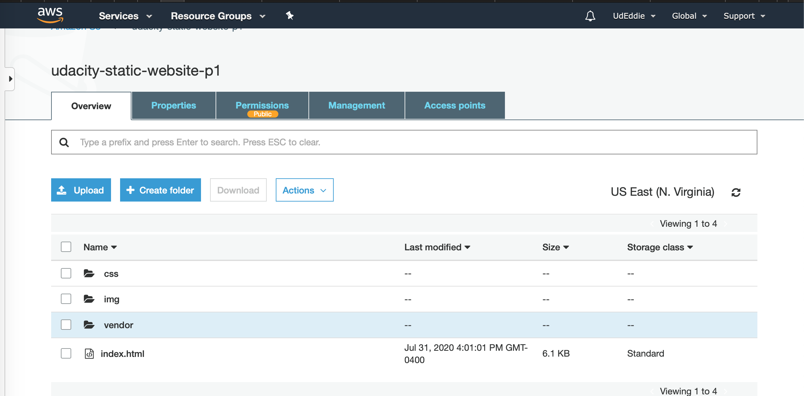
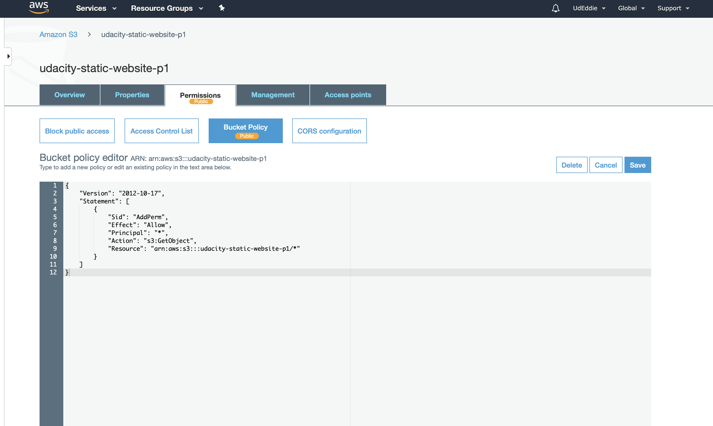

# Project 1: Deploy Static Website on AWS

### Cloud DevOps

In this project, we will deploy a static website to AWS using S3, CloudFront, and IAM.

The files included are: 

index.html - The Index document for the website.
/img - The background image file for the website.
/vendor - Bootssrap CSS framework, Font, and JavaScript libraries needed for the website to function.
/css - CSS files for the website.

# Steps

1. Create S3 Bucket 
   - Go to AWS Management Console and type S3, in the Find Services box, and select S3
   - Click Create Bucket
   - Enter a Bucket Name and click Next
   - Click Next to skip over Configure options
   - For Set Permissions uncheck Block all public access
   - Click Next and click Create Bucket
   - Once created click on the name of the bucket to open

   
   

___

2. Upload files to S3 Bucket 

   - Click Upload button
   - Click Add files button and drag and drop files and folders from your local computere to the S3 bucket
   and select Upload 

   
___

3. Secure Bucket via IAM

   - Click on Permissions tab 
   - Click on Bucket Policy and enter the buc policy below replacing "your-website" 
   with the name of your bucket and click save 
   
   {
  "Version":"2012-10-17",
  "Statement":[
    {
      "Sid":"AddPerm",
      "Effect":"Allow",
      "Principal": "*",
      "Action":["s3:GetObject"],
      "Resource":["arn:aws:s3:::your-website/*"]
    }
  ]
}

___

4. Configure S3 Bucket 

   - Click on the Properties tab and then click "Static website hosting"
   - Click on Use this bucket to host a website
   - For both index document and Error document, enter index.html and click save

___

5. Distribute Website via CloudFront

   - Select Services and enter Cloud Front, select CloudFront 
   - From the dashboard click Create Distribution 
   - Select a delivery method, Web, and click Get Started
   - Under Origin Settings, Origin Domain Name, Select the S3 bucket you just created
   - Under Origin Path enter / to indicate the root level
   - Under Domain Root Access enter index.html
   - Create Distribution
   _ Once the status changes from In Progress to Deployed, copy the endpoint URL in the 
    Domain Name column to access the website. 

___

6. Visit the Website 

   - Copy the endpoint above into the browser and the hosted website should appear. 

___

7, [My CloudFront Endpoint](http://dsudrn7i2ptul.cloudfront.net)

